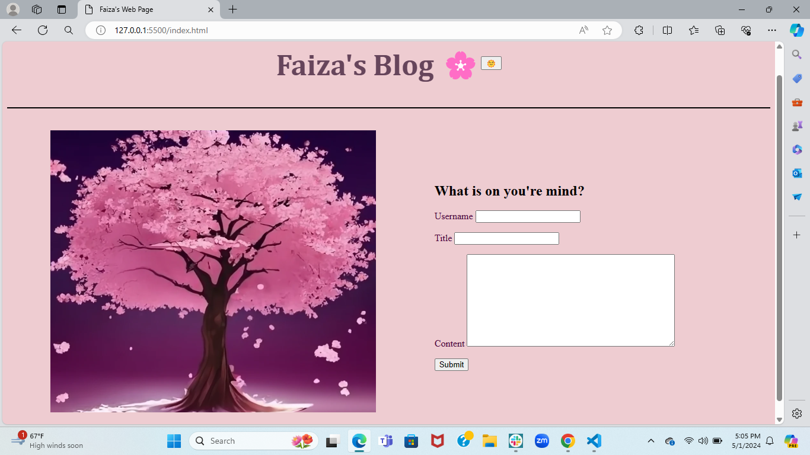
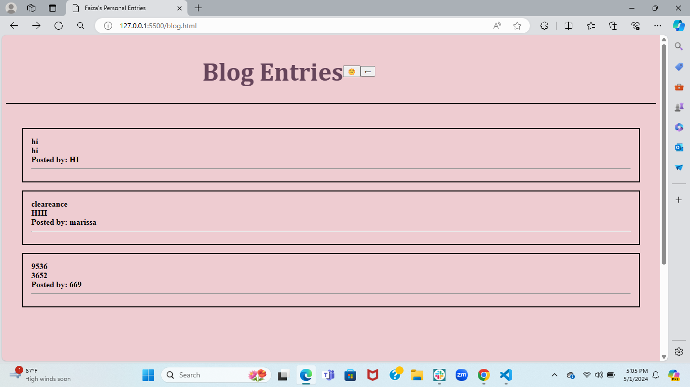

# Faizas-Blog

## Description
In this I created a two-page website where users will input and view their blog posts. It includes building a content form, dynamically rendering blog posts, and implementing a light/dark mode toggle.

## Deployed Link
[deployed link](https://faiza-haque.github.io/Faizas-Blog/)

## Screenshot of Project

  

## Credits
- [youtube video]( https://youtu.be/RiWxhm5ZdFM?si=QAqrC1_olVXs5vUc)
- [BlackBox] Blackbox code autocomplete is build to make developers faster while writing code. This Machine Learning program helped me with my comments and helped me understand the code I was writing.
- [W3Schools] W3Schools is a free web resource that provides information about HTML, CSS, and JavaScript. It is a great resource for learning web development.

## Acknowledgments 
- Tutors and TAs
- My Classmates
- My Instructor
- My Friends
Everyone listed helped me complete this project. I would like to thank them for their help and support.
